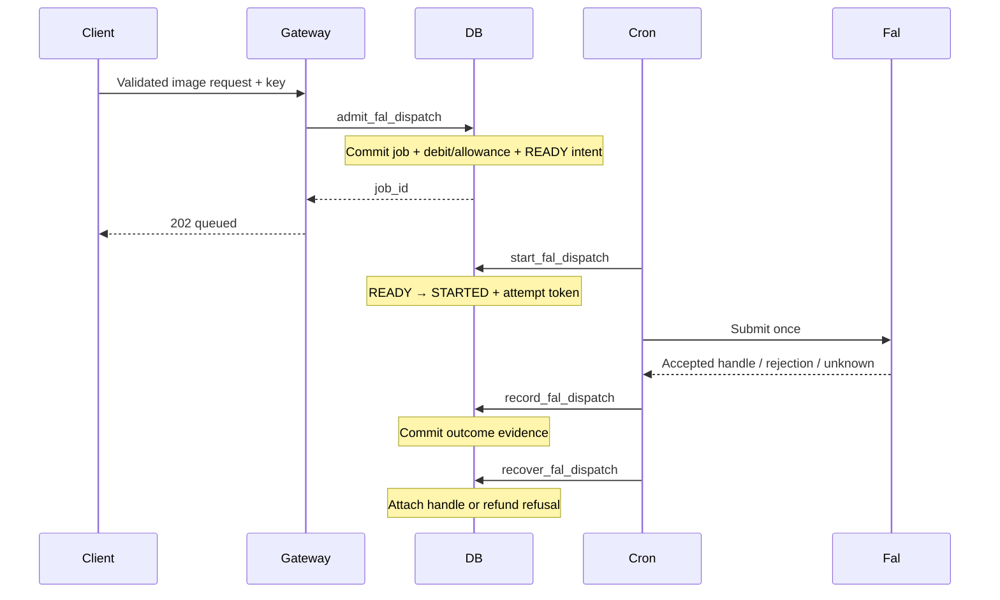

# ADR 0076 — Durable fal image dispatch

Status: Proposed 2026-10-08; built behind disabled flags. Local verification complete; staging and activation pending.

## Problem and scope

A synchronous generation route can die after debiting but before submitting, or lose an accepted provider handle before saving it. ADR 0075 treats ambiguous responses conservatively. This slice adds atomic dispatch intent and durable evidence for fal text-to-image jobs with no source uploads or source assets. Other generations, Chat, and composite jobs keep their existing path.

## Decision

Migration `0230_fal_durable_dispatch.sql` adds a private `fal_dispatch` outbox. Its job primary key records execution ownership; a legacy job replay never acquires an outbox row. Service-only SECURITY DEFINER RPCs use an empty search path and explicit grants. The table has forced RLS and no browser privileges.

`admit_fal_dispatch` locks the account's balance, compares any existing job's model and canonical JSONB inputs, and checks a durable job's endpoint and shaped provider payload as well. Changed requests return `IDEMPOTENCY_CONFLICT`. Equal replay returns the existing job without a new intent. New admissions check the current active, ungated fal image catalog row and use its price. They call the existing free-allowance or ledger-debit RPC and insert the intent in the same transaction. An intent failure rolls back the job, debit, and allowance. The catalog endpoint and shaped request payload are snapshotted so dispatch does not depend on later capability edits. Credentials are never stored in the outbox.

The gateway returns HTTP 202 with `job_id`, `state:DEBITED`, and `balance_after` after admission succeeds. Equal replay returns HTTP 200. Lost admission acknowledgement returns `dispatch_acceptance_unknown` with HTTP 503; it never falls back to a separate debit or submit. Studio treats this as an uncertain batch outcome and directs the user to Library. A trusted caller may replay the exact same key and request; changing the key creates a new request.



## Recovery contract

`start_fal_dispatch` claims one eligible job immediately before submission, using job row locks and SKIP LOCKED. A job already refunded or older than fourteen minutes cannot start. `STARTED` is irreversible: there is no reclaimable lease and no automatic provider resubmission. The attempt token fences evidence writes; it does not establish provider-side idempotency.

Accepted, rejected, and unknown evidence is committed separately from its projection onto `jobs`. Evidence writes can safely replay after a lost acknowledgement. A later recovery pass attaches a durable accepted handle with `job_submitted`, or refunds a proven refusal through the existing `ledger_refund`, including free-allowance return. One failing projection rolls back its own changes, retains evidence, and does not block other handles; recovery retries after a two-minute cooldown and reports a failed heartbeat.

A crash after STARTED, including before the network call, becomes UNKNOWN after two minutes. An immediate ambiguous response records UNKNOWN directly. Neither annotation changes the job's refund deadline. The existing fifteen-minute DEBITED cutoff and ten-minute database sweep remain the fallback, subject to backlog and sweep health. Late accepted evidence can resolve UNKNOWN. After a refund, evidence is retained without reviving or charging the job.

This provides at most one application submission attempt for each durable job, trading availability for safety at the uncertain boundary. It does **not** guarantee exactly-once execution by fal. Acceptance lost before evidence reaches the database still needs operator investigation; the existing webhook cannot safely correlate an arbitrary missing handle. Structured unknown events retain job, attempt token, and an available accepted handle, without prompts or credentials. No callback inbox is introduced: the existing signed fal webhook returns a retryable failure when job mapping is missing, before marking the event processed. Verify provider redelivery on staging; it is not a substitute for a durable inbox.

## Capacity and monitoring

The cron bridge processes at most ten new attempts per invocation with a three-minute work budget, serial fifteen-second provider deadlines, and bounded eight-second RPCs. It stops new spending when recovery or evidence persistence fails. The five-minute schedule permits at most 2,880 attempts/day before execution costs and failures; this is a ceiling, not measured throughput. Wait can approach a cron interval plus backlog. It cannot meet the architecture's proposed ten-second dispatch objective.

The recovery snapshot expects the `fal_dispatch` heartbeat while a durable job remains DEBITED. `fal_dispatch_unknown` counts uncertain pending work; `fal_dispatch_overdue` counts READY jobs older than ten minutes and unprojected accepted handles older than five minutes. The watcher supports these additive fields while accepting older snapshots. Retained accepted evidence on refunded jobs must also be reviewed against provider spend:

```sql
SELECT d.job_id, d.provider_job_id, d.resolved_at
FROM public.fal_dispatch d JOIN public.jobs j ON j.id = d.job_id
WHERE d.state = 'ACCEPTED' AND j.state = 'REFUNDED';
```

Before wider admission, measure queue age, effective drain, unknown frequency, DB round trips, and provider cost. Add event-driven reference messages and a verified inbox in a later slice when latency/reliability acceptance justifies them. Do not reset STARTED/UNKNOWN rows to READY during repair.

## Rollout

Both switches default false in production and staging:

- `FAL_DISPATCH_SCHEMA_ENABLED`: allows cron to read and recover the migrated schema.
- `FAL_DURABLE_DISPATCH_ENABLED`: admits new eligible jobs only when the schema switch is also true.

Apply migration 0230 through the protected migration workflow. On staging enable schema recovery first, verify heartbeat/secrets, then enable admission for bounded acceptance. Run failure injection before submit, after acceptance, around both evidence and projection acknowledgements, during concurrent sweeps, and with duplicate/early callbacks. Verify Library progress, delayed and immediate refunds, free allowance, changed replays, and provider spend. Require twenty-four hours clean reconciliation and agreed queued latency before production activation.

Rollback turns admission off while keeping schema recovery on for accepted work. A code rollback to a release without this runner strands READY jobs until the existing refund sweep; retain a compatible runner to finish them. Migration rollback or deleting evidence is not part of rollout.

## Local validation

Full fresh-schema replay and replaying 0230 succeeded. Real Postgres acceptance covers concurrent admission/claim, rollback on failed intent insertion, canonical replay/conflicts, crashed attempts, late evidence, projection outage, legacy ownership, free allowance, terminal refunds, monitoring, and privilege boundaries. Existing ledger backstops, default privileges, foreign-key indexes, subscription credits, and free-allowance tests passed. The full JavaScript suite passed 1,739 tests with one skipped; the final focused run passed 47 tests. All 360 ledger acceptance tests and twelve dispatch Postgres checks passed. Lint passed (74 existing warnings; the scoped lint also reports the existing Worker default-export warning), and the production Worker build completed. Local success does not satisfy staging or production activation gates.
