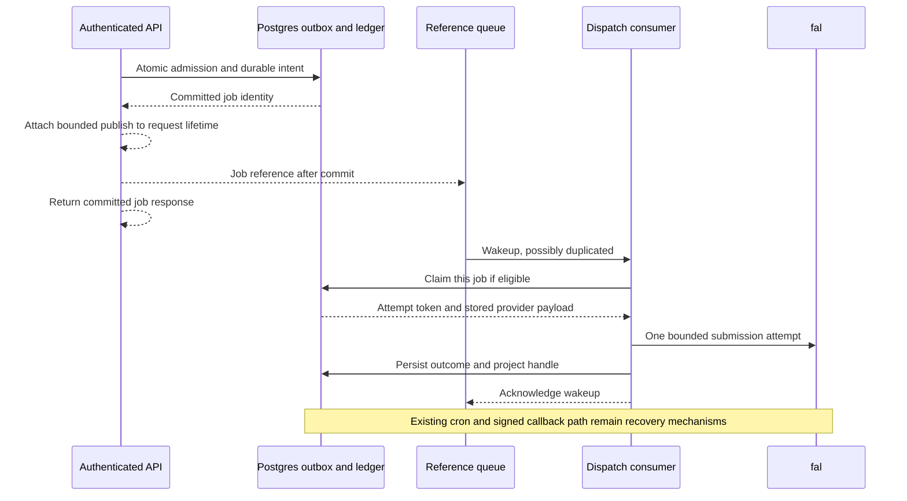

# ADR 0077 — Event-driven wakeups for durable fal dispatch

Status: Proposed 2026-10-09; targeted claims and producer/consumer code built, isolated staging queues and credentials provisioned, bounded live consumer and signed-in producer/Library acceptance passed, flags off. Fault injection, load, alerts, and the clean monitoring gate remain pending. See the [implementation and staging evidence](../architecture/fal-dispatch-queue.md). ADR 0076's activation gates remain binding.

## Problem and evidence

ADR 0076 makes admission atomic and retains submission evidence, but its five-minute cron is a recovery bridge. The [live staging fixture](../architecture/fal-dispatch-staging-2026-10-09.md) waited 201.67 seconds before claim and reached STORED after 213.06 seconds. This single observation is not a latency percentile. Ten attempts per five-minute invocation gives a ceiling of `10 × 12 × 24 = 2,880 attempts/day`, before failures and execution budgets.

The [system design](../architecture/system-design.md) proposes p95 admission-to-dispatch within ten seconds and an illustrative initial workload of 5,000 media jobs/day. Only a fraction of those jobs is eligible for this fal text-to-image slice; that fraction is not measured. The bridge cannot support all 5,000 and its idle scheduling delay cannot meet the proposed latency target.

The approach adapts Donne Martin's [System Design Primer](https://github.com/donnemartin/system-design-primer#asynchronism): separate interactive admission from asynchronous execution, size workers from measured service time, and apply back pressure before committing expensive work.

## Proposed boundary

Add a dedicated Cloudflare Queue and consumer Worker for fal image dispatch wakeups. Postgres remains the job, money, payload, and attempt authority. The queue holds only a versioned job reference:

```json
{"version":1,"job_id":"2c1f9b8c-57bb-49b5-9722-8e1b566284ad"}
```

No prompt, endpoint, user identity, price, credential, or provider handle goes into this message. Validate exact shape, version, and UUID before any database access. Producer bindings, consumer bindings, and databases must be physically separate between staging and production; verify their identifiers before deployment.



Publishing happens only after a confirmed admission result. Attach it to the OpenNext/Worker request lifetime with a bounded, awaited background promise; confirm that integration in a runtime test. A publish failure must not refund or change a committed admission response. A lost admission acknowledgement retains the existing 503 uncertainty response, with no fallback debit or provider call. Exact replay may publish another reference after a confirmed result.

Database admission and queue publication are not one transaction. A request can die between them. Retain the five-minute cron's direct READY-job claim as a backstop; it races safely with the consumer through the same database claim primitive. This gives prompt wakeups under normal operation and the existing slower recovery behavior when publication or delivery fails. It does not promise a ten-second bound during queue outage.

Cloudflare documents [at-least-once delivery](https://developers.cloudflare.com/queues/reference/delivery-guarantees/). Duplicate references are expected. A legacy replay without a dispatch row must remain ineligible and must never gain execution ownership.

## Claim and execution contracts

Implement a distinct service-only targeted claim RPC, for example `claim_fal_dispatch(job_id)`. Keep the existing no-argument `start_fal_dispatch()` contract for cron; avoid an ambiguous default-argument overload. Share the claim eligibility and transition logic so the paths cannot drift. Use an additive migration chosen from main when implementing, empty search paths, explicit browser revocation, and forced RLS on any new table.

Both claim paths require READY, DEBITED, no provider handle, and the existing fourteen-minute age limit. Acquire locks in the existing job-before-outbox order and use SKIP LOCKED. The targeted RPC needs explicit dispositions: CLAIMED with token/payload, BUSY, INELIGIBLE, EXPIRED, or MISSING. A skipped row lock must not be confused with terminal state. READY work with a busy lock needs another wakeup; already STARTED work must never be reclaimed.

Extract one bounded attempt routine used by both cron and consumer. Keep the fifteen-second provider deadline, identical evidence-write retries, failure isolation, and conservative UNKNOWN handling. A queue delivery retry never authorizes another provider attempt after STARTED. Consumer concurrency limits simultaneous submission handlers, not accepted generations still running at fal.

| Observation | Queue action and job behavior |
| --- | --- |
| Malformed or unsupported message | Record a redacted diagnostic and acknowledge; alert on unexpected volume. No DB/provider call. |
| MISSING, INELIGIBLE, or EXPIRED | Acknowledge. Never create an intent, revive a job, or refund directly from the message. Existing sweeps decide financial recovery. |
| BUSY or database failure before a confirmed claim | Retry the reference with bounded delay. A possibly committed STARTED claim still cannot be reclaimed on redelivery. |
| Confirmed claim, accepted or rejected evidence committed | Acknowledge after bounded projection/recovery. Projection failure retains evidence and is retried by cron, without submitting again. |
| Confirmed claim, uncertain provider outcome | Persist UNKNOWN if possible and acknowledge. Existing sweep/refund and operator investigation remain authoritative. |
| Provider evidence write unavailable after submission | Log job, attempt token, and an available accepted handle; acknowledge the wakeup after bounded writes. Alert immediately. Never retry the provider. Cron will annotate unresolved STARTED work. |

Use explicit per-message acknowledgements and retries, as described in [Cloudflare's batching guidance](https://developers.cloudflare.com/queues/configuration/batching-retries/), rather than retrying an entire batch after one failure. Configure a dead-letter queue for exhausted pre-claim deliveries. A dead-letter item is evidence of delivery trouble, not permission to reset a dispatch row. Replaying a reference may only attempt the ordinary claim again. Cron can drain an eligible READY job even if its reference is dead-lettered; unresolved work still follows the existing refund deadline.

This preserves at most one application submission attempt per durable job. It does not guarantee exactly-once fal execution, repair accepted responses lost before evidence persistence, or replace the signed callback mapping path. A verified callback inbox is a separate reliability slice.

## Capacity and back pressure

Initial staging settings are batch size 1, batch wait 0 seconds, consumer concurrency 2, three pre-claim delivery retries with a 30-second delay, and a dead-letter queue. These were verified on the disabled staging consumer; provider entitlements and live headroom remain unverified. Cloudflare supports configurable [batch size and wait](https://developers.cloudflare.com/queues/configuration/batching-retries/) and [consumer concurrency](https://developers.cloudflare.com/queues/configuration/consumer-concurrency/). Limit concurrency deliberately until provider and database headroom are measured.

Let `f` be the eligible fraction of media jobs, `s` the measured seconds occupied by a submission handler, and `C` concurrent consumer invocations. With one serial job per invocation, ideal drain is `C/s` attempts/second. For illustration, `C=2` and `s=2 seconds` gives 1 attempt/second, or 86,400/day before retries and overhead. This is a service-time assumption, not a benchmark; the provider deadline alone can consume fifteen seconds.

At the design's 5× peak factor, initial arrival is `5,000/86,400 × 5 × f = 0.289f jobs/second`; growth is `50,000/86,400 × 5 × f = 2.89f jobs/second`. If all are eligible and handler time is two seconds, two consumers cover the initial scenario but cannot drain growth arrivals. At a proposed 70% utilization ceiling, growth needs `ceil(2.89 × 2 / 0.7) = 9` submission slots, subject to provider approval. Do not raise concurrency from this formula alone.

Provider-running concurrency is a separate constraint: at 60-second generation duration, growth's sustained peak implies approximately `2.89 × 60 = 174` active generations if all are eligible. The queue's two submission slots do not enforce that limit. Measure catalog eligibility, fal account quotas, accepted-running jobs, UNKNOWN exposure, HTTP deadlines, and credit refunds before setting admission bounds.

A normal consumer invocation makes one initial recovery RPC, then three RPCs per claimed job: targeted claim, evidence write, and projection/recovery. With the configured batch size of one, this is four RPCs per job. At 5,000 eligible jobs/day that is approximately 20,000 calls/day, excluding admission, authentication, callbacks, duplicate references, and retries. A duplicate terminal reference still makes initial recovery and claim calls; evidence retry adds one more call. Measure actual amplification and service time. Queue operation and Worker CPU costs need a current priced estimate before provisioning; provider charges dominate only if measured costs support that conclusion.

Back pressure must happen before a new debit or free-allowance claim, using committed database backlog and provider headroom rather than queue depth as a financial authority. The eventual admission policy needs an atomic shared capacity reservation across accounts; a read-then-check count is insufficient. Existing equal replay must still return its job without consuming a capacity slot. Keep bounded staging admission until that policy and live headroom are accepted. When capacity is exhausted, return a typed retryable response before new money effects; do not invite clients to change keys after an uncertain committed admission.

See the [capacity readiness review](../architecture/fal-dispatch-capacity-readiness.md) for the current evidence and remaining measurements.

## Rollout and acceptance

1. Implement targeted claim, shared attempt execution, producer publication, and the dedicated consumer behind a separate default-off producer flag. Keep schema recovery on. Provision isolated staging resources only after cost and binding review.
2. Use controlled adapters to verify producer crash after commit, duplicate references, a lost claim acknowledgement, queue/cron races, BUSY disposition, malformed messages, pre-claim dead-lettering, slow providers, evidence/projection outages, and disable-producer rollback. Assert one provider attempt maximum, no extra debit, and preserved evidence.
3. Measure healthy-path admission-to-STARTED p50/p95/p99, oldest READY age, effective drain, DB RPC latency, queue redelivery/dead-letter counts, unknown frequency, and accepted-running provider concurrency. Logs contain identifiers and outcomes, never prompts or credentials.
4. Repeat bounded signed-in staging acceptance and the existing callback redelivery matrix. Confirm fallback behavior when publication or the consumer is unavailable. Agree the ten-second p95 objective and eligible workload before widening admission.
5. Require the existing twenty-four-hour clean credit/recovery gate and review measured cost/headroom before any production activation. A new queue does not complete ADR 0076's unfinished acceptance.

Rollback disables producer publication first while leaving consumer and cron recovery active. Already committed work drains; duplicate wakeups remain safe. Hard pausing a consumer is an operational action and must be reported as degraded dispatch latency. Never reset STARTED or UNKNOWN to READY, purge financial evidence, or treat dead-letter redrive as a provider retry.

## Alternatives

- **One-minute cron:** raises the theoretical ten-attempt ceiling to 14,400/day, but still adds up to a minute of idle scheduling delay and would need isolation from other five-minute recovery tasks. It cannot meet the ten-second objective.
- **Larger five-minute batch:** can raise throughput but retains the idle delay and increases provider/database bursts. It does not address the observed latency.
- **Submit in the HTTP request:** returns to the request-lifetime failure boundary ADR 0076 addresses. Durable admission stays useful only if execution has an independent recovery path.
- **Full workflow coordinator now:** adds orchestration beyond this single-attempt image slice. Reconsider for multi-step dependencies, not as a replacement for the credit ledger or attempt fence.
