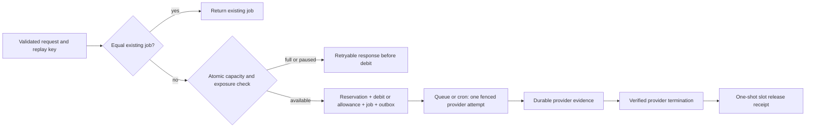

# ADR 0079 — Reserve fal capacity before charging for new work

Status: Proposed 2026-10-09. Design only; no migration, live policy change,
additional provider spending or production dispatch activation.

Adapted from Donne Martin's [System Design Primer back-pressure reasoning](https://github.com/donnemartin/system-design-primer#back-pressure),
following [ADR 0077](0077-fal-event-driven-dispatch.md).

## Evidence and uncovered paths

The [ten-image staging sample](../architecture/fal-dispatch-timing-sample-2026-10-09.md)
measured 403–1,062 ms consumer occupancy, 1.851–4.879 seconds admission-to-claim,
and 12.614–16.171 seconds admission-to-STORED. This does not establish sustained
throughput or a production p95. The sampled owner-designated fal account had
a concurrency limit of ten and zero active requests at the checks.

fal's [concurrency documentation](https://fal.ai/docs/documentation/model-apis/concurrency-limits)
counts IN_PROGRESS requests across the account; provider-queued requests do not
consume that running limit. Short submission handlers can therefore enqueue far
more work than the two-worker limit suggests.

| Current path | Gap |
| --- | --- |
| Durable image admission | `admit_fal_dispatch` commits debit/job/outbox atomically but has no shared capacity reservation across users. |
| Legacy generation path | `/api/v1/generations` reaches legacy debit and `provider.submit` when durable dispatch is disabled or a request is outside its image scope. Disabling durable dispatch is not an admission pause. |
| Auto Short provider steps | `lib/autoShortRuntime.js` calls the fal adapter independently of durable image admission. Parent-job counts cannot bound concurrent provider steps. |

Queue publication off also leaves cron able to submit committed READY jobs.
User-specific rate limits and queue-depth reads are not financial admission
authorities. Credit refunds do not prove uncertain provider work has stopped.

## Proposed pilot and shared authority

Propose a FLUX.2 Pro-only pilot with two outstanding reservations across users,
ten new admissions per UTC day and $0.30 worst-case daily provider exposure,
whichever limit is reached first. These are proposed launch bounds, not approval
to repeat the sample. Explicitly pin one output and 1024×768 before relying on
the assumed $0.03 unit cost; reverify billing and margins before activation.
Paid and free jobs consume the same provider budget. Missing policy denies new
admission; owner acceptance of model, budget and pool assignment remains required.

Key the pool by a server-controlled provider-account identity, not a user,
model, queue or API-key value. Use one shared Postgres authority with service-only
pool policy, unique attempt reservations, UTC-day exposure buckets and append-only
release receipts. Use integer USD micro-units. New tables require forced RLS,
no browser grants and definer RPCs with empty search paths. Store no keys,
prompts or signed asset URLs.

Two Supabase projects cannot independently enforce one shared provider-account
limit. Before activation, either integrate every producer/environment sharing
the fal account with one authority, or establish and verify genuine provider
account isolation. A separate API key is not isolation. The observed eight
remaining running slots are not reserved pilot headroom; retain the activation
block until this ownership question is resolved.

The transaction below assumes pool, ledger, job and outbox reside in the same
database. Moving only the pool to a remote project does not make two database
commits atomic. If shared-account producers cannot use that same authority for
admission, require a separately designed reservation-first coordination protocol
with orphan-reservation recovery, or isolate the provider accounts. Neither
cross-project HTTP calls nor two local counters satisfy this design's guarantee.

## Atomic image admission

1. Validate inputs/model, serialize on the user's balance and check equal replay
   before denying capacity. Replay returns the existing job even at full/paused
   capacity; conflicting replay returns 409. Neither reserves nor charges again.
2. Lock the pool and UTC-day bucket in a fixed order. Check pause, outstanding
   work and cost under those locks. An absent/unreadable policy fails closed.
3. Commit reservation, debit or free-allowance claim, job, outbox and exposure
   counter together. Any failure rolls everything back. Publish only after commit.
4. Queue and cron claims require the reservation and preserve the irreversible
   STARTED fence. Redelivery creates neither a new slot nor a provider attempt.

Admission may lock balance before pool but must not lock an old job after pool
acquisition. Release consumes already committed authoritative evidence and locks
only pool/bucket/reservation records; it must not invoke job-locking or money RPCs
while holding the pool. Establish the final ordering with concurrent database
tests against existing job-first refund/recovery paths before shipping a migration.

## Release policy

| Evidence | Required behavior |
| --- | --- |
| READY permanently closed before claim | Release only after the committed fence proves no submission can occur; return unused exposure to the original day bucket. |
| Definitive provider rejection | Release the slot after durable rejection; return exposure only if rejection is known not to be billable. |
| Accepted, including provider-queued work | Hold until authoritative provider terminal evidence. |
| STARTED acknowledgement lost, UNKNOWN, evidence write outage | Hold slot and worst-case exposure. No lease expiry, age or credit refund releases it. |
| Verified matching terminal success/failure | Record an idempotent receipt and release the slot once. Retain consumed/conservatively assumed exposure in the admission-day budget. |
| FAILED/refunded job without provider termination evidence | Keep the reservation. Financial state alone is insufficient. |

Require verified fal account identity, request mapping and durable terminal
evidence for release, never an unsigned callback or guessed job ID. A storage
retry does not require holding provider capacity after verified completion;
storage and financial recovery remain independent. An operator receipt resolving
UNKNOWN requires verified non-execution/termination and an audit reference. It
does not reset STARTED, resubmit fal or edit the ledger. A held UNKNOWN can stop
the pilot indefinitely; alert and investigate rather than assume capacity.

## Responses, rollback and other producers

Full or paused capacity returns typed 503 (`provider_capacity_unavailable` or
`provider_admission_paused`) with bounded Retry-After, before any new job, debit,
allowance use or publication. Keep it distinct from `dispatch_acceptance_unknown`:
after a lost commit acknowledgement, clients replay the same key.

Add a separate new-admission pause covering every in-scope fal producer. Pause
before changing routing/publication; retain equal replay, callbacks, evidence,
consumer drain and cron recovery. Rollback must not bypass the pool through the
legacy path. Publication pause alone can degrade latency and is not capacity pause.

Multi-step producers need a bounded parent-admission exposure/waiting/refund
policy before integration. Failing a later reservation after charging the parent
without that policy is unacceptable. Keep those producers outside an isolated
pilot account until their integration is accepted; do not count a parent as one
provider slot while its steps run concurrently.

## Example and implementation acceptance

With two slots, 100 distinct simultaneous admissions can commit at most two
reservations. The other 98 get capacity responses before money effects. Equal
replays still return existing jobs. UNKNOWN holds a slot even after refund;
a verified terminal receipt releases it once. This is target behavior, not a
live test already performed.

At an illustrative 15-second generation mean, Little's law suggests an ideal
two-slot ceiling of 2/15 = 0.133 jobs/second before uncertainty and scheduling.
The sample does not independently measure that mean. Neither this arithmetic
nor a ten-per-day pilot justifies a higher cap or establishes sustained drain.

Required disposable-database tests cover different-user concurrent admission at
the last slot and last budget unit; replay at full/paused capacity; free allowance;
rollback injection; lost admission acknowledgement; UTC rollover with prior-day
UNKNOWN; queue/cron and cancellation races; duplicate/out-of-order terminal
receipts; uncertain outcomes and deadlock checks. Assert reservation/exposure
bounds, one provider attempt and unchanged ledger invariants.

Inventory all producers, credentials and environments sharing the account
without exposing credential values. Observe counts-only occupancy, exposure,
oldest READY/UNKNOWN and release reasons. Review staging artifacts, scheduling
gaps, sustained-load evidence and actual costs before activation. The next build
slice is default-deny transactional image reservation; live migration application,
pool assignment, further paid samples and production activation are separate.
