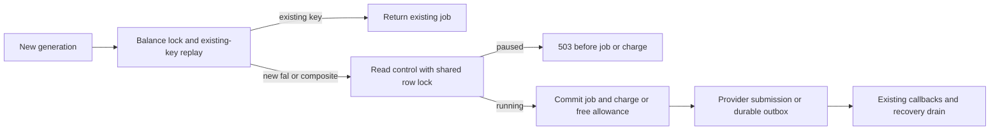

# Pause new fal admissions while existing jobs drain

Staging and production use the same aljobson fal account and separate databases.
Each has its own `fal_admission_control` row. Pausing one database does not
pause new submissions from the other database or independent montage producers.
See the [shared-account release review](../operations/fal-release-readiness-review-2026-10-10.md). Migration 0239 adds an independent
pause to the database functions that create paid and free jobs. It does not
replace the durable-image capacity policy in [PR 758](https://github.com/aljobson/Veyrnox.ai/pull/758).
This change is stacked on that PR and must follow its migration.

## Admission contract

A new paid job calls `ledger_debit`; a free job calls `submit_free_job`. After
locking its user's balance and resolving existing-key replay, either function
calls a private policy helper. A paused fal or Veyrnox composite model returns
`PROVIDER_ADMISSION_PAUSED`, retry after 60 seconds, before a job insert,
allowance claim or credit entry. The generations route maps this to HTTP 503
with `Retry-After`, including free refusals without falling through to a paid
charge. The durable-image admission RPC uses these same functions and inherits
the pause before committing any job, debit or reservation.

Scope is every catalog row whose provider is `fal` or `veyrnox`. Covering all
Veyrnox composites is conservative: Auto Short and Clip Editor submit fal
steps; Video Agent and any future Veyrnox composite are paused too, even if a
particular run would not use fal. Kie, BytePlus, GrsAI, chat and other direct
providers keep their current admission behavior. The catalog is operator-owned;
changing its provider identity changes this classification and needs review.

Existing-key replay preserves the predecessor RPC contracts. This slice does
not add payload equality checks to legacy ledger/free replay; durable replay
keeps its stricter equality checks. No new provider request is sent on replay.

## Concurrency and recovery

The helper takes a shared lock on the control row until its caller's transaction
ends. Multiple admissions can read concurrently. An operator update to pause
must wait for those transactions; once that update commits, later fresh
admissions see the pause. A missing row fails closed for covered models.
This establishes a database commit boundary, not instantaneous cancellation of
provider requests. Jobs committed before the pause can submit after it commits.

The lock order is balance, then the control row (durable admission additionally
holds its existing capacity policy lock). The operator transaction must update
only the control row and commit promptly; it must not acquire balance, job,
model or capacity locks afterward. Recovery, claims, callbacks, refunds and
composite step progression do not call the helper. They keep processing work
already owed to the user. No adapter submit switch is added that could strand
a previously charged parent between its steps.

The table has forced RLS. Browser roles have no table access; service_role has
read access only and cannot invoke the private helper directly. Existing
service-only debit and free RPC grants are explicitly preserved. There is no
application policy setter, provider credential or signed asset URL in the row.

## Rollout and remaining work

The initial row has `paused=false`, preserving existing admissions when the
migration is first applied. Reapplying the migration preserves an operator's
pause. The durable capacity policy still ships disabled. No live migration,
policy update, dispatch activation or paid generation accompanies this PR.

A reviewed operator change can set `paused=true` independently in either
database. Verify new paid and free fal/composite requests return 503 without
money effects, same-key replay works, and existing recovery continues. Set
`paused=false` in a separate reviewed transaction to resume; that does not enable
the durable-image capacity policy or its deployment flags.

This pause closes the rollback admission-control gap. It does not reserve
account capacity or bound spend for legacy direct/composite jobs while running.
Migration 0240 adds [reserved-only admission](fal-reserved-only-admission.md):
while capacity is enabled, those paths are refused before charge and reserved
images can still enter. Existing composite work still drains. Broadening the
allowed set needs a reservation protocol, terminal evidence and capacity
validation before production activation can claim an account-wide limit.

Validation includes a fresh replay of all 225 migrations, eight real Postgres
acceptance cases (including concurrent policy update versus admission), route
checks for paid/free 503 responses, and the existing dispatch/capacity and
subscription/free-credit suites. Test fixtures never contact fal or a live DB.

The stop-admission/drain-work design adapts the back pressure and asynchronous
job reasoning in Donne Martin's [System Design Primer](https://github.com/donnemartin/system-design-primer#back-pressure).
