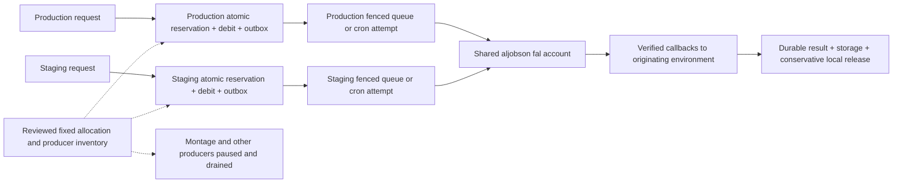

# Bounded rollout on the shared aljobson fal account

Status: proposed, 10 October 2026. This prepares a reviewable capacity decision;
it grants no spending or activation permission and changes no live settings.

The owner chose aljobson for both staging and production. Use fixed allocations
for the first bounded rollout, with a single active producer during the first
production canary. Reuse the database reservation transactions already built.
A dynamically shared pool is a later design, justified only when fixed
allocations prevent the intended workload. Independent database locks cannot
implement that pool.

This applies Donne Martin's [System Design Primer](https://github.com/donnemartin/system-design-primer),
especially [back pressure](https://github.com/donnemartin/system-design-primer#back-pressure)
and consistency during partitions. It refines the shared-account boundary in
[proposed ADR 0079 / PR #755](https://github.com/aljobson/Veyrnox.ai/pull/755);
it does not claim its remote coordination protocol has been implemented.

## Requirements and observed facts

Bound outstanding provider exposure before charging, preserve equal replay,
and keep recovery available for committed work. Paid and free jobs use the same
provider resources. UNKNOWN work must retain occupancy even after a refund.
The first reserved workload remains one FLUX.2 Pro output at 1024 by 768; video,
composite and montage steps need their own pricing and reservation contracts.

Both databases were read at 14:18 UTC on 10 October: capacity disabled,
provider_account null, outstanding_limit two, daily_limit ten,
daily_budget_microusd 300000, admission paused false, zero held reservations,
zero READY/STARTED/UNKNOWN dispatches and zero nonterminal direct fal or Veyrnox
composite jobs. These snapshots exclude independent montage runners and fal
Playground traffic. A terminal application job is not proof that an uncertain
provider request stopped.

The API-key inventory previously showed `Veyrnox.ai`, `veyrnox.ai-staging`,
`montage-runner-prod` and `montage-runner`. Key names indicate potential
submitters, not exhaustive credential attribution. A newly added key, Playground
request or script can invalidate a rollout's all-producer inventory.

The [approved staging callback sample](../operations/fal-post-tenant-callback-evidence.md)
proved its current signed tenant and one stored image in 9.794 seconds. It did
not prove the current production key's account or measure sustained capacity.
The last observed aljobson concurrency limit was ten at 11:35 UTC. Recheck the
actual account and endpoint limits before activation; ten is not a guaranteed
allocation. fal's [current concurrency documentation](https://fal.ai/docs/documentation/model-apis/concurrency-limits),
reviewed on 10 October through Agent Reach's web reader, distinguishes running
requests from provider-queued requests and notes account and endpoint limits.

## Recommended allocation

These values are proposed configuration ceilings, not an approved workload.
The zero rows mean an enforced admission pause and drained earlier work, not a
literal zero in columns whose schema minimum is one.

| Phase | Producer | Outstanding ceiling | New reserved jobs / UTC day | Reserved exposure / UTC day |
| --- | --- | ---: | ---: | ---: |
| First production canary | Production reserved FLUX.2 Pro | 1 | 1 | 30000 micro-USD ($0.03 assumed) |
| First production canary | Staging and both montage runners | 0 | 0 | 0 new exposure during the window |
| Later bounded rollout, separately accepted | Production reserved FLUX.2 Pro | 2 | 10 | 300000 micro-USD ($0.30 assumed) |
| Later bounded rollout, separately accepted | Staging reserved FLUX.2 Pro | 1 | 2 | 60000 micro-USD ($0.06 assumed) |
| Later bounded rollout | Both montage runners and other submitters | 0 | 0 | 0 until separately integrated |

For any accepted phase, require:

`sum(producer outstanding ceilings) <= verified account running limit`

and a separately reviewed bound for each selected endpoint. Outstanding
reservations include READY, STARTED, UNKNOWN and accepted queued/running work,
so this application bound is more conservative than fal's running counter.
Historical untracked/uncertain requests must be resolved or conservatively
included before applying the inequality. Spare provider slots are not available
for unbounded producers.

If the observed account limit of ten remains valid, the later three-slot
allocation leaves seven slots unused. It permits at most twelve new reserved
images and 360000 micro-USD ($0.36 assumed) per UTC admission day. These figures
exclude previous legacy spend, storage/compute charges and other account usage.
The $0.03 catalog assumption must match the pinned request and observed billing;
a reservation counter is not a fal billing guarantee or a fal balance limit.

Daily limits reset with the UTC admission date. They do not implement a
one-request lifetime authorization. Keep the first canary in a bounded window,
pause after its single committed admission, and never leave it open across
midnight. Already consumed reservation-day totals must be retained: do not
delete rows, reset counters or increase a ceiling to make the canary fit.

## Enforcement and ownership

Production project `xdxdzmsztyzbnzeforxx` owns its ledger, jobs, outbox and
reservations; staging project `yrqzwqywxfesmbvhzjgj` owns its own records. No
staging service role gets production database access. The same noncredential
policy label `aljobson` describes the external account; it does not serialize
two projects. Do not use an API-key value as an identity or copy it into a
reservation, report or browser response.

`admit_fal_dispatch` serializes the local user's balance and local policy, then
commits debit/free allowance, job, outbox and reservation in one transaction.
Equal `(user_id, idempotency_key)` replay returns its existing job even when
full or paused; changed inputs conflict. A local capacity refusal is HTTP 503
with `provider_capacity_unavailable`; a pause is `provider_admission_paused`.
A lost admission acknowledgement is `dispatch_acceptance_unknown`: replay the
same key to discover the committed result. Do not choose a replacement key.

An enabled local reservation policy also refuses new legacy fal and Veyrnox
composite admissions before charging through migration 0240's wrappers.
Rollback of a routing flag cannot safely bypass those wrappers. Their effect
includes new Auto Short, Clip Editor and Video Agent requests; this product
restriction must be accepted for the canary window. Earlier composite jobs
can still submit later steps, so pausing only new parents is insufficient.
Drain and account for existing steps before activating a partition.

Independent montage runners need a verified stop-new-work control covering
scheduled, queued and manual starts, plus evidence that existing steps have
drained. The application databases do not implement that control. A key's
existence, a dashboard count of zero or an operator's intent to avoid traffic
is not enforcement. If any submitter cannot be fenced or bounded, this rollout
remains blocked; its occupancy and cost cannot be assumed zero.

An owner-only production canary admission gate is also a prerequisite, not an
existing capability established here. Bind it to authenticated server-side
identity and enforce it in the admission transaction before new money effects.
Model/routing flags alone expose the scarce slot to every eligible user. A
browser-only button restriction cannot establish the canary boundary.

## Failure, quota changes and worked example

The partition's safety comes from fixed quotas, not a periodically read sum.
Under a network partition, an environment can use only its own already accepted
allocation while its authoritative database and policy remain available. An
unreadable local policy fails closed for fresh work; it cannot borrow another
environment's apparent idle allocation. UNKNOWN remains held. Retain daily
exposure after rejection or release, matching the conservative implementation.

The current release function frees occupancy for definitive REJECTED, CLOSED
before any attempt token, or matching ACCEPTED plus STORED evidence. FAILED,
refunded, old, orphaned or timed-out work alone does not free it. A storage
outage can therefore stop this pilot even after generation finishes. Record
and investigate the held reservation; do not add a timeout release to restore
throughput. Queue redelivery and cron share the existing one-attempt fence.

In the later proposed partition, suppose 100 distinct production requests and
100 staging requests arrive together. With clean empty pools, at most two
production and one staging admissions commit; the rest receive local capacity
responses before new money effects. If one production attempt becomes UNKNOWN,
that reservation still occupies its slot after refund and UTC rollover.
Staging cannot borrow it, and a duplicate queue delivery cannot submit it again.
This is expected behavior to verify in acceptance, not a measured live result.

To transfer an allocation, pause affected producers, drain or resolve all
covered work, lower the donor limit, commit and verify it, then raise the
receiver limit under review. Never raise first or infer available quota from a
stale read. Keep existing exposure counters and check already consumed budgets.
If drain cannot be established, retain the old allocation.

For scale estimates, let `W` be mean reservation holding time, including queue
wait, generation and storage. Ideal throughput is at most `slots / W` jobs/s.
With an illustrative W=15 seconds, three slots give 0.2 jobs/s before failures
and scheduling overhead; twelve admissions/day instead average
`12 / 86400 = 0.000139 jobs/s`. The pilot's daily budget binds long before that
ideal throughput. The single 9.794-second observation is not a mean or SLO.
Measure holding time, oldest READY/UNKNOWN, rejection rates and actual spend
before raising limits. No cache, database shard or additional submission worker
solves the missing all-producer boundary.

## Rollout and evolution

1. Review and merge the relevant exact-head PRs separately. Rebuild admission
   acceptance against current main and all migrations; newer wrappers must
   retain pause, reserved-only and replay guarantees. No merge applies a live
   policy or authorizes a paid call.
2. Complete the health-window review, including post-tenant callback evidence,
   sampling gaps, source/DLQ metrics and server scan freshness. Current clean
   snapshots and elapsed time alone do not pass this gate.
3. Implement and verify the default-off owner-only canary gate. Establish actual
   control points and owners for both montage runners and every other key or
   Playground submitter. Get explicit approval for the temporary product
   restriction and exact one-image production spend.
4. Prepare a counts-only before/after configuration diff for protected operator
   review: pause new admissions, drain covered work, verify the fal account and
   current quota/balance, assign the proposed policy and deploy the matching
   producer/consumer configuration while paused. Attribution of the current
   production key must be resolved before opening the canary admission; a
   historical production request or masked binding name cannot establish it.
5. After all gates and owner approval, open only the owner canary admission,
   pause immediately after the single committed job, and verify one attempt,
   signed callback tenant, debit, inbox event, stored asset and authenticated
   Library rendering. A failure or lost acknowledgement stops new work while
   evidence/recovery continue. Never retry the fal POST to get a cleaner result.
6. Review actual billing and acceptance before proposing the later allocation.
   Pause before rollback; disabling capacity while unpaused restores legacy
   admissions. Keep schema/recovery access for committed jobs.

If montage must run concurrently, or production routinely saturates its two
slots while staging has spare capacity, design one shared reservation authority
covering every provider attempt and every environment. It needs idempotent
reservation identity `(account, environment, intent, step)`, reserved worst-case
cost, authenticated commit/terminal receipts, and orphan reconciliation that
fences local admission before releasing a provisional reservation. A lost
cross-database commit acknowledgement cannot be resolved by lease expiry.
Multi-step parents need a budget/wait/refund contract before they are charged.

Moving a policy table to a remote database or putting a semaphore around HTTP
submission does not atomically reserve before the local debit. Adding that
authority requires a separately reviewed coordination protocol and failure
tests; this first partition introduces no new cloud service. Separate fal
accounts remain an alternative requiring a new owner decision, because the
owner selected the shared account.
