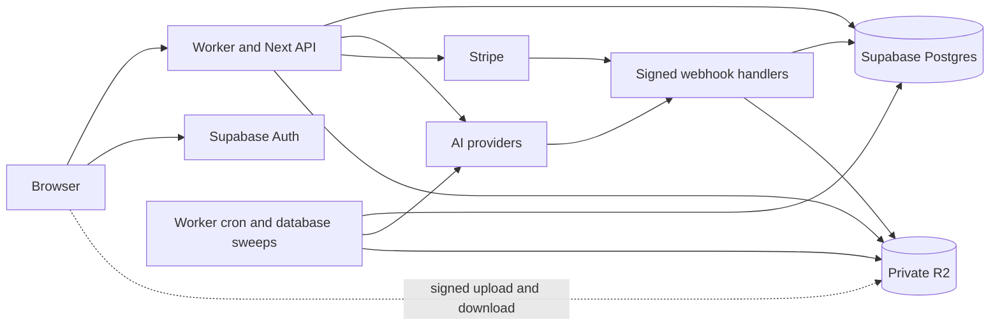
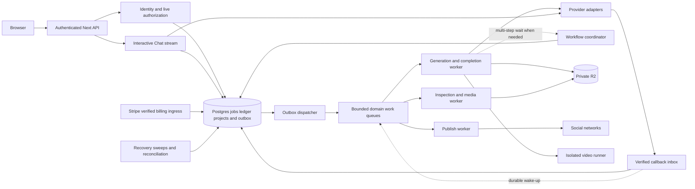

# Veyrnox AI system design

Veyrnox should retain its Next.js/OpenNext application, Supabase identity and relational state, private R2 media, provider adapters, and single credit ledger. The next architecture step is to make expensive external work durably recoverable, then separate background execution where measured capacity or failure isolation requires it.

Scope: the AI platform in this repository, including Studio generation, Chat, projects, Publish, Cinema, and the video agent. This is a design proposal dated 8 October 2026, based on checkout `6ee0f4e3`. Configuration describes intended deployments; it does not establish live resource settings, current traffic, or completed rollout checks. Existing ADRs remain authoritative until a behavior change is accepted.

The approach adapts Donne Martin's [System Design Primer](https://github.com/donnemartin/system-design-primer), especially requirements, estimates, component design, and incremental scaling. The workload scenarios and Veyrnox-specific recommendations below are original assumptions and analysis.

## Existing foundations

| Boundary | Repository evidence | Design consequence |
| --- | --- | --- |
| Web and API | [`worker.js`](../../worker.js), [`middleware.js`](../../middleware.js), [`wrangler.jsonc`](../../wrangler.jsonc) | Keep Next.js/OpenNext and the verified bearer-token gate. Worker cron currently runs every five minutes. |
| Money | [`CLAUDE.md`](../../CLAUDE.md), [`0183_subscription_credit_bucket.sql`](../../packages/db/schema/supabase/0183_subscription_credit_bucket.sql) | Keep append-only entries, per-account transactional locks, bucket-aware debits/refunds, freezes, and reconciliation. |
| Generation | [`generations/route.js`](../../app/api/v1/generations/route.js), [`registry.js`](../../packages/provider-sdk/registry.js) | Validation and pricing precede debit; provider submission currently follows debit in the request. |
| Completion | [`providerCompletion.js`](../../lib/providerCompletion.js), [`fal/route.js`](../../app/api/webhook/fal/route.js) | Success and stored output are distinct states. Callback replay and missing provider correlation need explicit recovery. |
| Chat | [`chatTurn.js`](../../lib/chatTurn.js), [ADR 0067](../adr/0067-chat-replies-are-jobs.md) | A reply uses the same jobs and credit system; keep interactive streaming and its documented cancellation rules. |
| Projects | [`tenant-client.js`](../../packages/db/tenant-client.js), [ADR 0051](../adr/0051-tenant-platform-foundation.md) | Tenant reads carry the user JWT; project mutations check live membership and audit transactionally. |
| Media | [`r2Copy.js`](../../packages/adapters/r2Copy.js), [`projectAssets.js`](../../lib/projectAssets.js), [ADR 0056](../adr/0056-project-media-quarantine.md) | Preserve owned-source validation, private storage, bounded copies, quarantine, and inspection. |
| Publish | [`socialPublishSweep.js`](../../lib/socialPublishSweep.js) | Existing target claims and progress records are the foundation for durable publishing. Some adapters already distinguish uncertain submission. |
| Video agent | [ADR 0074](../adr/0074-openmontage-video-agent.md), [`montage/SPEC.md`](../montage/SPEC.md) | Keep isolated bounded compute and the existing paid-job lifecycle; runner rollout is a separate gate. |
| Operations | [`TRD.md`](../product/TRD.md), [`recoveryHealth.js`](../../lib/recoveryHealth.js) | Keep recovery heartbeats, nightly reconciliation, protected migrations, and health-checked deployment. |

The default production configuration enables Chat and disables tenant projects, Publish, Cinema, subscriptions, and the video agent. Named staging settings differ. A feature can exist in source while its production user path remains closed; activation must follow the existing acceptance plan.

## Requirements and invariants

Creators need reliable generation, replies, owned uploads, private downloads, and understandable credit outcomes. Project collaborators need versioned documents and immediate membership enforcement. Publishers need scheduled delivery with visible per-network outcomes. Operators need to detect stuck work, money drift, storage pressure, and provider spend.

Keep these invariants across every implementation phase:

- One financial authority: `credit_balances.balance = SUM(ledger_entries.delta)` per user, with the Free and Subscription bucket constraints preserved. The free allowance is a price waiver through its existing path, not a new credit bucket.
- One durable job identity per user/idempotency key. Replaying a request cannot buy a second provider run. Proposed payload fingerprinting must reject the same key with different normalized inputs.
- A provider success is not a delivered asset. Media jobs become usable only after output is privately stored and registered. Chat has its own persisted-reply completion rules.
- Tenant IDs are resource selectors. Verified identity, live membership, resource ownership, and narrowly granted functions establish access.
- Queues, workflow events, browser state, and cached balances cannot authorize spending or access. Durable relational records decide.
- Private project masters stay private. Cinema publication creates a separately controlled derivative; Publish grants only the scoped media access its network needs.

## Current data flow

Legacy media/billing routes use privileged server access and must enforce ownership through their RPC contracts. Project routes deliberately use caller JWTs and RLS. A privileged service role bypasses RLS; forced RLS does not make that credential safe to use without explicit authorization. Supabase documents this distinction in its [RLS guidance](https://supabase.com/docs/guides/database/postgres/row-level-security).

## Capacity model

These scenarios are planning inputs, not traffic forecasts or verified capacity. Replace them with measured active users, per-feature traffic, output sizes, provider latency, and RPC counts before provisioning.

Assume per daily active user: 5 media jobs, 20 Chat replies, and 60 other authenticated reads. Assume 12 status polls per media job: one every five seconds over an illustrative 60-second run. Use a sustained 5× peak factor; retries, webhooks, uploads, publication, and page/static requests are additional load.

| Quantity | Initial scenario | Growth scenario |
| --- | ---: | ---: |
| Daily active users | 1,000 | 10,000 |
| Media jobs/day | 5,000 | 50,000 |
| Chat replies/day | 20,000 | 200,000 |
| Other reads/day | 60,000 | 600,000 |
| Status polls/day | 60,000 | 600,000 |
| Modeled application requests/day | 145,000 | 1,450,000 |
| Average requests/s | 1.68 | 16.78 |
| Peak requests/s at 5× | 8.39 | 83.91 |
| Peak media submissions/s | 0.29 | 2.89 |
| Peak Chat turns/s | 1.16 | 11.57 |

Formulas: requests/s = requests/day ÷ 86,400; peak = average × 5. Growth read traffic is 1.2 million reads versus 250,000 job-creating requests, about 4.8:1 at the API boundary. This ratio does not describe database reads/writes: a single generation, callback, or Chat turn invokes several RPCs.

With media execution averaging 60 seconds, Little's Law gives growth concurrency of approximately `2.89 × 60 = 174` jobs during a sustained peak. With Chat averaging 15 seconds, growth streaming concurrency is approximately `11.57 × 15 = 174`. These are separate demand pools. Measure duration distributions and provider concurrency limits; longer video/research runs materially change both estimates.

Assume one retained output per media job: 70% images at 3 MB, 20% videos at 30 MB, and 10% audio at 5 MB. Weighted output size is `0.7×3 + 0.2×30 + 0.1×5 = 8.6 MB` decimal. Initial output growth is 43 GB/day; growth output is 430 GB/day. At an illustrative 30-day retention, that is 1.29 TB and 12.9 TB respectively, before uploads, multiple outputs, derivatives, and backups. Actual product retention follows its existing policies.

If growth outputs are downloaded twice each, delivery is 860 GB/day, about 79.6 Mbit/s average or 398 Mbit/s at 5×. Keep bulk browser transfers on signed R2 paths. Retention, output multiplicity, and video size deserve more attention than adding database shards at this workload.

Provider spend is the sum over models of `accepted runs × measured cost per run`, plus search, research, and video-agent costs. Retries and provider-accepted jobs later refunded to users remain provider spend. Use the catalog margin model and observed costs; no infrastructure budget or provider price is inferred here.

## Architecture proposal

Keep a modular application and one relational database initially. Add a durable dispatch boundary for expensive work; extract background Workers when needed. Do not introduce a second ledger, database-per-feature, or a framework migration as part of this design.

All new boxes represent proposed boundaries, not provisioned infrastructure. Queue and workflow adoption also requires confirming permitted metadata storage/processing locations and retention. Opaque job UUIDs and account references can still be personal data. EU storage of database/media does not establish EU-only processing by Workers, providers, or orchestration services.

| Boundary | Owns | Access and extraction rule |
| --- | --- | --- |
| API and policy | Input validation, identity, membership, admission, safe responses | Keeps browser-facing routes. Never accepts client pricing or provider endpoints. |
| Billing | Ledger mutations, account freezes, entitlements, reconciliation | Transactional RPC authority; no generic ledger-write API for consumers. |
| Job orchestration | Dispatch attempts, provider handles, deadlines, step progression | Owns job/step transitions; adapters cannot mutate balances directly. |
| Media | Upload inspection, private asset registration, deletion and derivatives | Scope access by asset/job/project; never turn private masters public. |
| Chat | Bounded context, live stream, stored messages, stop/failure outcomes | Reuses jobs and credits; keep low-latency streaming outside batch dispatch. |
| Publish | OAuth lifecycle, due-target claims, per-network progress | Separate provider concurrency and retry budgets from AI generation. |
| Cinema | Publication, viewing entitlement, moderated delivery | Remains behind existing rollout flags until accepted. |
| Video runner | Bounded per-run compute and provider calls | Isolated filesystem/process, scoped credentials, spend/output limits, signed ingress and completion. |

Internal Worker extraction should use [Service Bindings](https://developers.cloudflare.com/workers/runtime-apis/bindings/service-bindings/), preserving trusted caller context and resource-level authorization. Bindings provide connectivity; they do not replace tenant checks. Give each boundary only the secrets and database operations it requires. Keeping modules together remains preferable until independent execution or failure isolation warrants extraction.

## Durable generation and recovery

### Make the submit boundary explicit

The current fal adapter converts a fetch timeout/transport exception to `{ok:false}`. The generation route sends unsuccessful submissions to `refundRejectedSubmit`. A timeout does not prove the provider rejected the request. Separately, provider acceptance followed by a failed `job_submitted` write can leave the provider handle unrecorded. The fal callback retries when it cannot find that handle; retry alone cannot restore a handle that was never durably captured. These are recovery risks visible in source, not claims of observed production incidents.

Introduce an internal dispatch-attempt record with conceptual phases `PREPARED`, `SUBMITTING`, `ACCEPTED`, `REJECTED`, and `UNKNOWN`. These are proposed attempt phases, not replacements for the existing `jobs.state` enum. Persist provider, job, stable external request key when supported, attempt number, lease/fencing token, timestamps, and accepted handle. Keep inputs in the database; queue messages carry only opaque references and a schema version.

An explicit refusal can use the existing idempotent refund path. A transport failure, unparseable acceptance response, or process crash after submission begins is `UNKNOWN`: reconcile with the provider using a supported request key, handle, or verified correlation before retry/failover. Providers without lookup or idempotent submission require a bounded operator-reconciliation path. Do not automatically retry a billable call just because a workflow step failed.

Unknown outcomes need an elapsed-time policy and visible pending status. If evidence cannot resolve one before the accepted deadline, an operator can make one idempotent compensating refund and close the attempt as unresolved, absorbing possible provider cost. A late callback must be recorded without recharging or reopening a terminal job. Accept that product and financial policy in an ADR before changing current behavior.

### Commit intent with the job

For a new asynchronous media request, atomically create the job, apply the existing debit or free-allowance path, and write a dispatch outbox entry. This requires an additive reviewed RPC/migration; a separate application insert after debit recreates the crash gap. Retain current debit/refund accounting initially. Reserve/settle and organisation budgets remain later product/accounting decisions from the target-state backlog.

Scope idempotency to actor, operation, and key. Store a canonical fingerprint of the model and price-relevant normalized inputs. Same key/same fingerprint returns the original job; changed inputs return a conflict. Current paid `ledger_debit` returns an existing job by key without comparing inputs, so this behavior needs deliberate migration and replay tests. Free jobs and Chat must receive consistent treatment without bypassing their existing rules.

A dispatcher leases due outbox rows, emits reference messages, then records dispatch. A crash between emitting and recording can emit twice. Consumers deduplicate effects against durable attempt/state records and use fencing on state updates. A fence cannot undo a provider call: once an old consumer might have started submission, a new consumer must reconcile rather than submit again.

[Cloudflare Queues provides at-least-once delivery](https://developers.cloudflare.com/queues/reference/delivery-guarantees/). Treat duplicate and out-of-order messages as normal. Durable intent stays in Postgres so queue expiration, failed emission, or a dead-letter event can be recovered. Acknowledge after durable effect/progress commit; persist delayed retries and unresolved outcomes before acknowledging. Never hold an unacknowledged message through a long video run.

### Separate progress from wake-ups

Verify callbacks before persisting a bounded inbox record. Deduplicate by provider/event identity, retain processing state, and acknowledge only after durable receipt. Processing re-fetches authoritative provider status where required. Unknown job correlation is retained for reconciliation rather than discarded. A queue notification wakes processing but the inbox record remains the source of truth.

Single-step providers can use due polling and callback-driven continuation. Use [Workflow event waits](https://developers.cloudflare.com/workflows/build/events-and-parameters/) for Auto Short, Clip Edit, or the video agent when durable multi-step waiting simplifies their existing step machine. Read durable state before waiting and after wake-up; a callback that arrives early must not disappear into a missed event. The workflow coordinates execution; job and ledger records remain authoritative.

Each step needs a deterministic effect key. Bounded safe retries apply to provider status reads and idempotent storage operations. External submissions need their own ambiguity policy. R2 writes should reuse an effect-specific key on retries; asset registration must verify expected job, ownership, MIME, length, and digest before marking output stored. Failed copy/registration remains recoverable and cannot become a success visible to the user.

## Critical request contracts

Preserve existing routes unless an accepted ADR calls for a versioned change. The asynchronous generation response below is proposed; it must coexist with legacy clients during rollout.

| Operation | Contract and consistency |
| --- | --- |
| Create generation | `POST /api/v1/generations` with model, normalized inputs, and idempotency key; proposed `202 {job_id,state,balance_after}` after job/debit/outbox commit. Project scope is additive and requires live membership checked in that transaction. |
| Read progress | Existing jobs route returns authorized persisted state and actionable failure/pending reason; poll with bounded backoff and jitter. A read never resubmits work. |
| Chat turn | Existing thread-scoped route authenticates ownership, bounds context/search/attachments, debits once, and streams. Preserve cancellation after text versus failure/refund rules from `chatTurn.js`. Reconnecting cannot create another paid turn. |
| Save document | Project/document mutation carries current version and operation key where supported. Stale versions return conflict; history/audit commits atomically. Do not extend creation-replay guarantees to all existing metadata mutations. |
| Issue media link | Ownership/live membership check before issuing a short-lived signed link; at most 15 minutes. Revoking membership stops future minting; an already-issued URL may remain usable until expiry. Immediate revocation requires a gateway/object policy change. |
| Billing callback | Verify Stripe signature, re-fetch authoritative payment state as required, deduplicate, apply one credit mutation transactionally. Keep recovery backfill and freeze/refund semantics. |
| Scheduled publish | Commit approved target and due time; claim with a fence, recheck account/entitlement, progress independently per network. Ambiguous network acceptance blocks blind retries. |

For future project jobs, record actor and project attribution immutably. Recheck authority before new external submission. Membership removal must not grant an asynchronous worker renewed access; already-paid work may finish into private storage under its recorded attribution, but revocation still blocks downloads. Define retention/refund treatment for deleted projects before activation.

## Cache and overload policy

Public catalog/template data can tolerate bounded staleness. Reuse the existing public catalog cache and set an explicit freshness policy; authoritative submit-time catalog reads decide price, model activation, and capabilities. Do not cache account balances, live membership, freezes, or entitlement decisions as authority.

Coalesce refreshes and jitter expiry to avoid a cache-miss burst. Cache-down behavior is bounded reads to the origin with load shedding rather than unbounded fan-out. Return private progress and signed-link responses with no-store behavior; never mix private objects into shared public caches. Review the race between cached model display and authoritative model/price changes in the UI.

Limit admission by user/account and provider concurrency, plus approved spend ceilings. Enforce strict provider counters in a single authoritative transaction/coordination boundary rather than Worker-local memory. A queue buffers bursts; it does not increase provider quota or spending capacity.

Before a job is charged, reject work that cannot meet the accepted backlog/deadline budget with a typed retryable response. After acceptance, queue unavailability cannot lose the intent or charge again: the outbox retains it. Quarantine poison work after a bounded retry policy, alert on it, and reconcile its credit outcome exactly once. Expensive render/inspection work gets its own bounded compute budget.

## Background capacity risks

At five-minute cadence there are 288 scheduled invocations/day. Publish claims one batch of at most 25 targets per invocation and processes it sequentially: a theoretical ceiling of 7,200 target-processing passes/day before runtime, quota, failure, or continuation costs. One post may require multiple passes. This is not a completed-post throughput guarantee. A due target also waits up to a nominal cron interval before its first claim, plus backlog and execution time.

GrsAI selects at most 50 jobs per invocation: at most 14,400 checks/day, with a three-minute work budget and serial media storage. Pending jobs consume checks and oldest-first selection can delay newer jobs. At the growth scenario, if 20% of 50,000 jobs use that provider and each requires two checks, demand is 20,000 checks/day before retries, above that theoretical ceiling.

Measure oldest due age, checks per completion, effective drain rate, and task duration. Give polls a persisted next-check time and fair due ordering; separate new submissions, polls, and heavy completion copies. Replace hot-path cron dispatch with bounded consumers before its drain rate falls below arrival rate. Keep cron as a repair backstop. Shared `Promise.allSettled` isolates rejected promises, but tasks still share an execution's resource budget; heavy media and publishing work merit separate execution boundaries.

## Proposed service objectives and recovery

These are initial acceptance targets, not current performance claims. Exclude planned refusals such as insufficient credits from infrastructure availability, and report provider failures separately from internal failures.

| Surface | Proposed target | How to establish it |
| --- | --- | --- |
| Authenticated reads | 99.9% successful valid requests/month; p95 ≤750 ms | Synthetic and real request measurements, split by DB and API latency |
| Durable job acceptance | p95 ≤2 s, excluding separately reported source inspection | Timestamp validated request through durable commit; track inspection time separately |
| Internal dispatch | p95 ≤10 s when within admitted provider capacity | Outbox committed time to first submit-attempt start |
| Provider completion to stored result | p95 ≤60 s for validated assets within existing size caps | Callback/status completion time to private asset registration |
| Publish scheduling | p95 first dispatch ≤60 s after due time | Requires durable dispatch; current five-minute cron cannot satisfy it |
| Money integrity | No uninvestigated reconciliation differences; duplicate delivery never duplicates a financial effect | Existing reconcile checks plus replay/race acceptance tests |

Generation duration and Chat first-token time need objectives by provider/model/modality. Provider processing is often the dominant delay; do not promise a universal completion time. A 99.9% time-based objective permits 43.2 minutes downtime in a 30-day month; request-based objectives use failed eligible requests instead.

Propose database recovery RPO ≤5 minutes and RTO ≤60 minutes only after backup/PITR plan capability and a restore drill support those values. Define separate media and orchestration recovery objectives. Object retention is not a backup, and database restoration does not recover deleted objects or rewind external provider/payment effects. After a restore, reconcile retained ledger data with Stripe and provider evidence before resuming new spend. Preserve irreversible external-reference records and define replay rules to prevent double grants or submissions.

Correlate request, job, step, provider handle, dispatch attempt, inbox event, and billing event using structured identifiers. Track oldest outbox/inbox age, unknown submissions, refund lag, duplicate attempts, provider spend, pool/lock pressure, R2 copy memory, task heartbeats, and per-network publish backlog. Redact prompts, OAuth credentials, tokens, and signed URLs. Page on money drift, unknown billable work past its deadline, missed recovery heartbeats, and increasing age despite active consumers.

## Delivery sequence

The first fal outcome-handling slice is implemented behind a disabled flag; [ADR 0075](../adr/0075-fal-submit-outcomes.md) describes its pending-response behavior and existing-sweep fallback. The next fal text-to-image slice is also built behind disabled flags: [ADR 0076](../adr/0076-fal-durable-dispatch.md) adds atomic job/debit/outbox admission, canonical replay checks, durable outcome evidence, and bounded cron recovery. It permits one irreversible attempt and cannot meet the ten-second dispatch objective on the five-minute cron. A verified inbox, event-driven wake-ups, and automatic reconciliation of acceptance lost before durable evidence remain proposed work.

| Phase | Work | Exit gate |
| --- | --- | --- |
| 1 Measure and close ambiguity | Add common lifecycle timings; normalize accepted/rejected/unknown submit outcomes; fingerprint replay semantics; specify missing-handle correlation and operator resolution | Failure injection before/during/after submit and before handle persistence; no second provider run or double refund; user-visible behavior covered by an ADR |
| 2 Durable dispatch | Add job/debit/outbox transaction and verified inbox continuation for one provider behind a flag | Crash between commit/emission/ack, duplicate/out-of-order callbacks, expired leases, and missed wake-ups recover from DB state |
| 3 Isolate execution | Extract completion/media and Publish workers through internal bindings; add bounded queues and fair due polling | Measured drain exceeds admitted arrivals with headroom; cold cache and heavy-copy tests respect limits; scheduling target demonstrated |
| 4 Tenant workflows | Extend authorization/attribution into generation, enable accepted project paths, then adopt multi-step workflows where needed | Two-tenant, revoked-membership, stale-document, deleted-project, and replay tests; legacy jobs remain usable |
| 5 Product activation | Complete existing Publish/Cinema/subscription/video-agent acceptance tracks | Existing product-specific staging evidence, applied migrations, and 24 hours clean reconciliation; enable flags deliberately |
| 6 Scale from evidence | Optimize queries/round trips; add suitable read replicas or partitioning only at demonstrated limits | Replica-lag contracts, partition hotspots, recovery drills, and cost measurements justify each new boundary |

Use [the existing implementation backlog](implementation-backlog.md) for foundation dependencies and [the product implementation plan](../product/IMPLEMENTATION-PLAN.md) for launch gates. This sequence refines their durable-work items; it does not mark them complete or bypass billing/platform acceptance.

Migrations must remain additive, replay-safe, and compatible with the previous release. Apply production migrations through the protected workflow. During dispatch migration, each job has one recorded execution mode so legacy sweep and new consumer cannot both submit it. Shadow consumers may inspect/compare state but must never invoke billable providers. Roll back admission to the legacy path while allowing already-accepted durable jobs to finish; retain outbox/inbox records and reconciliation. Code rollback does not roll back data or external actions.

## Implementation acceptance

Before widening traffic, run the existing unit/build/security suites and real-Postgres ledger/tenant tests appropriate to each implementation. Add failure-injection coverage for accepted-but-timeout provider calls, lost handle persistence, duplicate/out-of-order webhook events, R2-copy/registration failure, replay with changed payload, consumer crash after external effect, membership revocation, and restore followed by payment/provider reconciliation.

Load tests should use controlled adapters and bounded staging data. Exercise hot accounts, slow providers, full queues, cache outage, oldest-first polling pressure, concurrent cron/consumer claims, Chat disconnects, and large permitted media copies. Establish actual RPC amplification, memory peaks, provider headroom, and storage growth. Passing application tests alone does not establish the capacity scenarios or recovery targets above.
