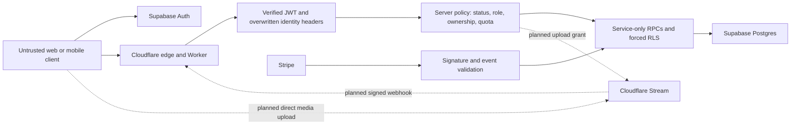

# Cinema security architecture

Assessment date: 25 September 2026. Baseline: main `2f60cec` (PR #325). This is a source/configuration review, not a penetration test or certification. No production setting, schema, credential or behaviour changes in this assessment.

The [Security Engineering Brief](https://chatgpt.com/s/t_6ab644e42ac88191aaa6ea4cf6403e27) is a mandatory overlay on the [Cinema implementation specification](https://chatgpt.com/s/t_6ab643224f9881919a05694d64a5a7dc). Security belongs in every feature PR, not a final cleanup phase. Read the [repository assessment](../REPO-ASSESSMENT.md) and [release gaps](SECURITY-GAP-ASSESSMENT.md) before feature work.

## Baselines and evidence

Target ASVS Level 2 for Cinema; apply explicitly selected stronger controls for payouts, privileged roles, recovery, moderation and financial administration. These are targets, not compliance claims. The [ASVS mapping](ASVS-MAPPING.md) records partial evidence and unassessed controls.

- [NIST SSDF 1.1 / SP 800-218](https://csrc.nist.gov/pubs/sp/800/218/final) is the final baseline used here. [SSDF 1.2 initial public draft](https://csrc.nist.gov/pubs/sp/800/218/r1/ipd), published December 2025, is tracked separately; draft guidance is not labelled a final requirement.
- [OWASP ASVS 5.0.0 release](https://github.com/OWASP/ASVS/tree/v5.0.0/5.0) supplies versioned verification IDs.
- [OWASP API Security Top 10, 2023](https://api-security.owasp.org/editions/2023/en/0x11-t10/) supplies API abuse categories, not a substitute for testable requirements.

## Trust boundaries

The existing database is Supabase Postgres, not D1. Retain its transaction, provisioning, RLS, immutable ledger and reconciliation protections. If D1 is introduced later, it needs a new trust-boundary review, bound statements and proven equivalent controls. No new service acquires trust merely by being a Worker, queue consumer or authenticated caller.

## Current controls and required extensions

| Boundary | Existing evidence | Required Cinema extension |
| --- | --- | --- |
| Identity | `middleware.js`, `lib/supabaseJwt.js`: ES256/JWKS, issuer/audience/expiry, Bearer-only, overwrite identity headers | Resolve account state and scoped permissions for every protected operation; evaluate token type and time claims fully. |
| Profiles | Migration 0132: own-profile RPC, strict projected public fields, no client grants, forced RLS, locked idempotent creation | Explicit suspended/banned-account policy, logged denials and correlation before public enrollment. |
| Roles | Private Cinema membership; server-managed existing admin role | Multi-role deny-by-default matrix, creator ownership, separate moderation/finance privileges, audited grants/revocations. Existing `users.is_admin` must not silently authorize every Cinema action. |
| Admin | AAL2 gate for metrics, configured Access application, edge throttling; machine routes verify Access assertions | Sensitive Cinema endpoints require independent identity, current scoped role, recent strong auth, server-verified Access where applicable, audit, per-user quota and self-review restrictions. |
| Input | `limitRequestBody`, profile allowlist/length limits, parameterized RPCs | Validate all paths, query/header/body fields and provider payloads; reject unknown mutation fields. TS types alone do not validate. |
| Browser | React text rendering, CSP/security headers, session identity isolation, same-origin gateway | No arbitrary creator HTML. Bearer-only mutations stay non-GET; audit Origin/CORS policy. Cookie flows require explicit CSRF controls. |
| Secrets | Worker/CI secret references, no browser service role | Inventory minimum provider scopes, rotation owners and automated secret detection. Never global Cloudflare keys. |
| Money | Stripe top-up signature verification, event deduplication, immutable credit accounting | Separate cash ledger/entitlements; integer minor units, currency, deterministic rounding, refunds/holds/reconciliation, no client-set prices. |
| Storage/video | Existing private R2 signed access and upload constraints | Separate private evidence/contracts; short-lived Stream grants, provider-confirmed processing, quota, rights and moderation before publication. |
| Logs | Auth rejection logs, provider checks, Worker observability | Uniform generated request IDs, redacted security event inventory, privileged before/after context, protected retention and alert routing. |

## Authorization policy to implement

VIEWER/SUBSCRIBER can access only policy-permitted content and their own settings/history. CREATOR can manage their own drafts; it cannot self-approve, grant monetisation, select earnings or change ownership. MONETISED_CREATOR is a separate eligibility grant. MODERATOR can review content within assigned scope, never financial adjustments. FINANCE_ADMIN can act on cash operations within policy, never grant platform privileges. PLATFORM_ADMIN manages assigned platform capabilities; high-impact actions still require step-up and audit. Unknown roles/states deny.

Recheck authoritative status and permissions on every sensitive action, including processing a delayed event. Feature flags only restrict availability. UI visibility, client roles, Supabase user_metadata, token issuance time alone, and the permissions of a service-role intermediary grant no user authority. Public catalogue projections must explicitly exclude internal IDs, email, moderation evidence and financial fields.

## Data and operational policy

Store only necessary data. Profiles are opt-in; no email in public projections. Financial history, review reasons and security logs need documented retention and access, with deletion/anonymisation rules approved before launch. Do not copy production data into development. Payout providers should retain identity/banking documents. Device/risk signals need necessity and retention review before collection.

Untrusted creator text, reports and AI outputs cannot directly fetch arbitrary URLs, execute code, change roles, ban accounts, publish restricted content or release funds. Use deterministic authorization and human review for high-impact decisions. External fetches use approved destinations, protocol/redirect restrictions and bounded responses. Reject provider events that fail signature, timestamp where supported, type, environment, ownership binding or idempotency checks.

Changes must use protected PRs, locked dependencies, isolated tests and controlled production deployment. Verify actual GitHub/environment protections rather than assuming a YAML file proves enforcement. Critical/high exploitable security findings block release absent explicit recorded owner risk acceptance. Never weaken auth, RLS, TLS, signatures, CORS or bucket privacy to pass tests.
