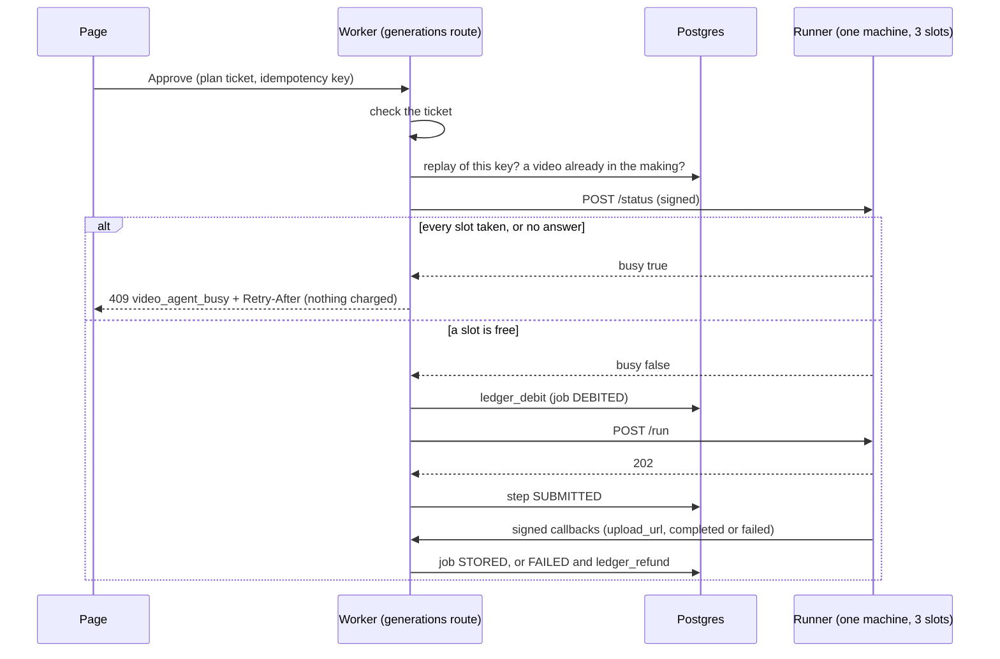
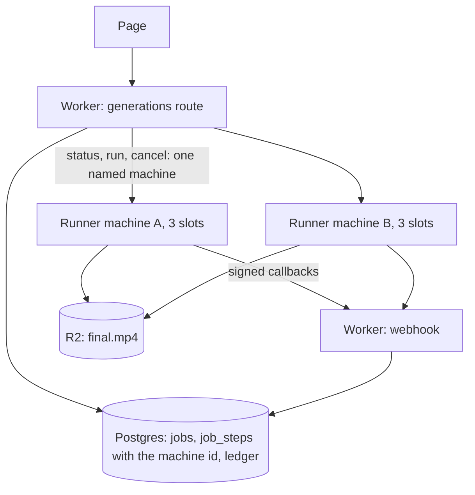

# Video agent: capacity design for gate G6 (written and decided 2026-10-08)

Answers [RUNBOOK-production.md](RUNBOOK-production.md) gate G6: "queue, more machines, or a waiting message". Background:
[ADR-0074](../adr/0074-openmontage-video-agent.md), [SPEC](SPEC.md). Checked against main at `efe273e8`, the runner repo at `daf6867`
and the staging runner's live settings (read 2026-10-08 20:30 UTC).

**Updated 2026-10-08 21:30 UTC:** section 5 adds the machine's measured CPU use. It overrides the slot arithmetic in sections 1
and 4 for the machine the runner is on today: the limit there is the CPU quota, about 4 runs an hour, not the number of slots.

## Decision (owner, 2026-10-08: "approve")

What was put to the owner and approved:

1. **A busy runner is refused before the debit**: "nothing was charged, try again". On main since #651.
2. **Capacity is added when a measured trigger is hit**, not before.
3. **No queue yet.** A queue turns refusals into waits and adds no throughput.
4. The trigger as proposed: two or more runs started within one hour, on three days out of seven. It was worked out for **one slot**.

### What changed while the proposal was being read

The proposal described one slot, which was true when it was written. Since then:

- **The runner takes three runs at once**, not one (runner `096aaae`, 19:04 UTC; `RUNNER_MAX_CONCURRENT = "3"` on staging). Its own
  comment says "a starting guess: not load-tested". This is the cheap step this design would take first anyway (more on one machine
  before more machines), and it needs no routing. It moves the trigger in point 4: with three slots the same rule gives a different
  number. **That number was proposed here and is now withdrawn:** section 5 shows three at once does not hold on this machine.
- #651 also limits each account to one video in the making at a time.
- #652 and runner `daf6867` close the hole this design found: a start that was never confirmed is now cancelled before the refund, and
  a cancel that reaches the runner before its run is remembered, so the run is refused.

## 1. Use cases and constraints

### In scope

- **User** approves a plan while a slot is free, and the run starts at once.
- **User** approves a plan while every slot is taken, and is told so without being charged.
- **Service** frees a slot when a run finishes, fails, is cancelled or hangs.
- **Service** never holds credits for work that has not started.
- **Service** leaves enough of a record to decide capacity from numbers.

### Out of scope

- Priority between users, or paying to skip the line.
- Making a run faster or cheaper (gates G1 and G3).
- Brief moderation (G5), alert destinations (G7), more than one region.

### Constraints the code and the rules already set

- Every debit has a refund path, the ledger is append-only, and one plan buys one run (the idempotency key comes from the plan).
- `sweep_stuck_jobs` refunds any job still `DEBITED` after **15 minutes** (migration 0099). A job cannot wait in that state for longer.
- A run is never retried: each one spends up to its ceiling (`lib/montage.js`).
- The runner keeps its runs **in memory, per machine** (`runner/runs.py`). `/status`, `/cancel` and replay detection only know the
  runs on the machine that answers.
- The runner address is a constant, every call is signed, and a new Worker secret means the secret-edit procedure.
- A change to the money path needs an ADR update, an acceptance test and a flag.

### Measured

| Fact | Value | Source |
|---|---|---|
| Time per run, approve to stored | 245 s (one full success, **running alone**); the agent alone took 187 to 237 s over three runs | SPEC sections 6 and 9 |
| Runs at once per machine | **3** on staging since runner `096aaae` (was 1). Not load-tested | staging runner settings |
| Machines | 1 (4 shared CPUs, 4 GB) | staging runner settings |
| Runner's own limit on a run | 30 minutes | runner `fly.toml`, `RUNNER_RUN_TIMEOUT_SECONDS` |
| Worker's lost-run refund | 45 minutes | `lib/montage.js`, `TIMEOUT_MINUTES` |
| Idle machine exits after | 10 minutes; the next signed request starts it | runner `fly.toml` |
| Worker waits for the runner | 20 s per call | `lib/montageRuntime.js` |
| Most a run can spend | $2.50 at fal and $2 of tokens; $13.50 with three in flight | runner `fly.toml` |
| Price | 165 credits, $5.45 at the $0.033 floor value | SPEC pricing worksheet |
| Plan ticket lifetime | 30 minutes | SPEC section 4a |
| A refusal after the debit (the old path, still the fallback) | refunded in 21 s; two ledger rows and a failed job in the Library | SPEC section 9 |

### Assumptions (demand is unknown before launch)

- Approvals arrive independently of each other. A launch post makes bursts worse than that, so the figures below are floors.
- The busiest hour carries 15% of a day's approvals.
- A refused user does not retry at once. Retries raise the load further.
- **A run takes 245 s whether it runs alone or beside two others.** Now known to be false on the current machine (section 5): the
  final cut is CPU work, and the machine's CPU quota covers about one cut at a time.

### Usage

One slot finishes at most 3600 / 245 = **14.7 runs an hour**. Offered load = approvals per hour x 245 / 3600. A slot is one run in
progress, wherever it runs. Share of approvals refused in the busiest hour (Erlang B, refused requests are lost):

| Approvals in the busiest hour | About per day | 1 slot | 2 slots | 3 slots |
|---|---|---|---|---|
| 1 | 7 | 6% | 0.2% | under 0.1% |
| 4 | 27 | 21% | 2.8% | 0.3% |
| 10 | 67 | 40% | 12% | 2.7% |
| 15 | 100 | 51% | 20% | 6.5% |

Load that keeps refusals under 10% in the busiest hour, **where the machine has the CPU for it** (on today's machine it does not;
section 5):

| Slots | If a run takes 245 s | If sharing the machine doubles it to 490 s |
|---|---|---|
| 1 | 1.6 approvals an hour, about 11 a day | 0.8 an hour, about 5 a day |
| 3 | **18.7 an hour, about 124 a day** | 9.3 an hour, about 62 a day |
| 6 | 55 an hour, about 368 a day | 28 an hour, about 184 a day |

What a queue would do on one slot instead (mean wait before the run starts, fixed run time): 46 s at 4 an hour, 4.3 minutes at 10 an
hour, 16 minutes at 13 an hour, without limit at 14.7. The tail is several times the mean.

Money: a refusal before the debit costs nothing. A lost sale forgoes 165 credits against a cost of up to $2.72. Machine time is a few
cents a run (runbook). The real cost of another slot is exposure: each one is another $2.50 and $2 that can be in flight at the same time.

## 2. High-level design: refuse before the debit

This is what main does since #651. The `/status` arrow is there because of one number: with one slot, 6% to 40% of approvals met a
busy runner (table above), and each of those was a debit, a failed job and a refund.

## 3. Core components

### Use case: every slot is taken

1. The page sends Approve with the plan ticket and the key the ticket names.
2. The route checks the ticket (`checkPlan` in `lib/montageGate.js`).
3. `checkCapacity` looks for a job with this user and key. If one exists this is a replay: the remaining checks are skipped and
   `ledger_debit` answers it as the replay it is.
4. It looks for a video this account already has in the making (`DEBITED` or `SUBMITTED`). If there is one:
   `409 {error: "video_agent_in_progress"}`.
5. It calls the runner's `/status`. The runner answers `{busy, active, max}` from its table of live threads.
6. Busy: `409 {error: "video_agent_busy", retry_after_seconds: 120}` with a `Retry-After` header. No job row and no ledger row.
7. No answer, or a malformed one: `503 {error: "video_agent_offline"}`. Nothing charged.
8. The page shows the message. Pressing Approve again works with the same ticket for its 30 minutes.

No schema change. The part that is not obvious: **check then act is not atomic.** Two approvals can both read `busy: false` for the
last slot. The loser's `/run` gets `429 montage_busy` and falls through to the old path: debit, fail, cancel, refund.
The window is the time between `/status` and `/run`. Accepted.

### Use case: a slot is freed

| Event | What frees the slot | When |
|---|---|---|
| Run completes or fails | its thread ends; `/status` counts one fewer | at once |
| Worker cancels | `/cancel` sets the run's stop flag | seconds |
| Run hangs | the runner stops the agent and reports `timeout` | **30 minutes**; the Worker's sweep refunds at 45 if no report arrives |
| Machine dies | the in-memory table is gone; all slots free on restart | on restart; every run it held is refunded by the sweep at 45 minutes |

With three slots a hung run costs a third of the capacity for up to 30 minutes. With one it refused everyone. A machine death now
ends up to three runs at once: three refunds, and fal bills the clips that finished.

### Use case: the service leaves a record

Started runs are `jobs` rows, so runs started per hour can be read today with no new code. A refusal before the debit leaves no row.

## 4. Scale the design

One change at a time, each only when its trigger is seen. The rule behind every trigger is the same: **add capacity when the
busiest hour refuses more than 10% of approvals on three days out of seven.** Until refusals are counted, it is read from runs started.

| Stage | State | Trigger (evidence) | Change | What it costs |
|---|---|---|---|---|
| 0 | replaced by #651 | n/a | Refuse after the debit | A debit, a failed Library entry and a refund per busy approval |
| 1 | **on main** (#651) | The first table in section 1 | Refuse before the debit | No fairness: whoever presses first wins. The user must come back. A fixed 120 s hint against 245 s runs |
| 2a | **on staging; section 5 predicts it fails when three cuts coincide** (runner `096aaae`) | With one slot: two or more runs started within one hour, on three days out of seven (the approved trigger) | Three runs on the one machine | Runs share 4 CPUs and 4 GB, so each may slow down. $13.50 in flight at once. Up to nine fal clips and three agent sessions in parallel. One machine death ends three runs |
| 2b | not built | Withdrawn until the machine size is chosen (section 5): the earlier proposal of 17 or more runs started within one hour assumed CPU the machine does not have | A bigger machine first, then machines addressed one by one, see below | A list of machine ids to keep current. More in flight at once. Needs G8 |
| 3 | not built | 2b is in place, refusals are still above 10% in short bursts, and the machines are idle most of the day. Or users must be able to leave the page | A bounded line, see below | Credits held for work not started, or a debit that can fail later. New states in the money path. ADR, acceptance tests, a 24-hour reconcile soak |

### Small improvements inside stage 1

1. Done (#652, runner `daf6867`): a start that was not confirmed is cancelled before the refund, and the runner remembers a cancel that
   arrives before its run.
2. Have `/status` report how long each live run has been going, so the hint is honest: 245 s minus the oldest run's age, never under 30 s.
3. Let the page retry by itself while the tab is open and the ticket is valid.
4. Count refusals (reason: busy, offline, lost the race), so lost sales are known and not estimated.

### Stage 2b: why a second machine is not `fly scale count 2`

With two machines behind Fly's proxy and the runner as it is:

- `/status` answers for whichever machine the proxy picks. "Free" on one says nothing about the other, and `/run` may land on the other.
- `/cancel` on the wrong machine does not stop the run. Since runner `daf6867` that machine remembers the cancel for 15 minutes, which
  does nothing for a run already going elsewhere. The Worker refunds and the run keeps spending.
- The proxy cannot see a busy machine: `/run` answers 202 at once, so its request limits do not help.

Design: the Worker names the machine. A Worker var lists the machine ids. The capacity check asks each in turn with Fly's
`fly-force-instance-id` request header (Fly's dynamic request routing: it forces one machine, with no fallback) and takes the first that
is free. `/run` goes to that machine, the id is stored with the step, and `/cancel` and the sweep use it. Needs a column for the id
(a migration), the runner returning its own id, and a test that a cancel reaches the right machine. To check on Fly first: that a forced
request starts a stopped machine.

Rejected for now: a machine per job through Fly's Machines API (ADR-0074's first sketch). It scales further but puts a Fly API token in
the Worker. A fixed pool needs no new secret.

### Stage 3: what a queue would need

- A place to wait that is not `DEBITED` (the stuck-job sweep refunds at 15 minutes), or a place in line with the debit taken only when
  the slot opens (then the balance or the 30-minute ticket can fail at that moment).
- A dispatcher on the completion callback, with the five-minute cron as the fallback.
- A bounded depth. Past it, refuse as in stage 1. An unbounded queue is the failure, not the fix.
- Position and an estimate for the user, and a cancel-while-waiting with its refund.

## 5. Measured after the decision: on this machine the CPU quota is the limit, not the slots

Read on 2026-10-08 21:30 UTC from Fly's own metrics for the staging runner. Nothing was run and nothing was spent.

### One real run, alone (job `647470d0`, the only full success so far)

| Measure | Value |
|---|---|
| CPU the run used | about **220 CPU-seconds**, nearly all in the last 80 s (the cut), peaking at 2.65 of the 4 CPUs |
| The first 150 s, waiting on fal | under 0.2 CPUs |
| Memory | 318 MB idle, 1,371 MB at the peak: about 1,050 MB for one run |
| CPU burst balance | 225 CPU-seconds before the cut, 42 after. Never throttled, with 42 to spare |

### How this machine's CPU is rationed

The runner is on a Fly `shared` size. From Fly's "CPU performance" page and the machine's own metrics:

- Its sustained quota is **0.25 of one CPU** for the whole machine (`fly_instance_cpu_baseline` reads 0.25).
- Above that it spends a burst balance. The balance earns 0.25 CPU-seconds per second the machine is up (measured: 149 in 600 idle
  seconds), earns nothing while the machine is stopped, and starts at about 200 after a deploy (seen five times today). Highest seen: 853.
- At zero, the machine is held to 0.25 CPUs until the balance recovers.

### What follows

Worked out from that one run with a one-second simulation. It reproduces the measured run (232 s against 245 s), and it is a little
kind to the machine. **These are predictions, not tests.**

| Case | Balance at the start | Last run finishes after |
|---|---|---|
| One run, spaced out | 225 | 3.9 minutes (measured: 4.1) |
| One run right behind another | 50 | 11 minutes |
| Two at once | 200 | 16 minutes |
| **Three at once, after a deploy** | 200 | **30.5 minutes: past the runner's 30-minute limit, so three timeouts and three refunds, with about $7 already spent at fal** |
| Three at once, machine up for a while | 500 | 10.5 minutes |
| Three at once | 650 or more | 5 minutes |

- **The sustained ceiling is 0.25 x 3600 / 220 = about 4 runs an hour, whatever the slot count.** Section 1's 14.7 runs an hour per
  slot is wall-clock time and does not hold on this machine. Neither do its figures for three slots.
- Spaced-out runs are fine. A run and its 10-minute idle tail keep the machine up about 14 minutes, which earns about 210
  CPU-seconds, roughly what the run spends.
- Memory: three cuts at the same moment need about 3.5 GB of the 4 GB.

### So the three-at-once test was not run

It is predicted to fail and to spend about $7 doing so. It also needs three signed-in accounts (one video per account at a time);
staging has three accounts with 165 credits or more, and signing in is the owner's.

### Options, cheapest first

| Option | Effect | What it costs |
|---|---|---|
| A. Dedicated CPUs: a Fly `performance` size (full quota, no balance). `performance-2x` is 2 CPUs and 4 GB | About 32 runs an hour by CPU. One run in 4.2 minutes, three at once in 7.6 | A higher per-second price while the machine is up (a run plus its 10-minute tail); read Fly's price list. Three cuts at once still need about 3.5 GB, so consider 8 GB |
| B. Keep the machine and set the slots back to 1 | Honest about what it can do: one at a time, about 4 an hour | A run right behind another is slow (11 minutes). Section 1's one-slot refusal figures apply |
| C. Make a run need less CPU (720p output, a faster encode setting) | In proportion | Output quality: a product decision |

A is the one that makes three slots true.

**Decision 2026-10-08 (owner: "A"): dedicated CPUs.** Not applied yet: staging still runs the shared machine with three slots, so
until it is applied a burst of three approvals there can still become three refunds and a fal bill. To apply it:

1. Put the size in the runner's `fly.toml`. A `fly scale` on its own is undone by the next deploy from that file.
2. Read Fly's current per-second price for the size and write the cost per run next to it. It has not been read.
3. Deploy to staging when no run is in flight, then pass the lockdown checks on the new machine (`scripts/verify-on-fly.sh`).

Proposed setting: `performance-2x` (2 CPUs) with 8 GB if three slots stay, or its standard 4 GB with two slots.

## Open questions and next measurements

1. Decided: option A in section 5 (owner, 2026-10-08). Still open when it is applied: 8 GB with three slots, or 4 GB with two.
   The stage 2b trigger is set after the first three-at-once run on the new machine.
2. **Three runs at once on staging: only after option A.** It then costs about $7 at fal and $1.30 in tokens and needs three
   signed-in accounts. Record each run's time, the machine's peak memory, and any refusal from fal or Anthropic. It can be three of
   G3's ten runs.
3. Staging: `/status` against a machine that has exited. If it takes longer than 20 s, a user who returns after 10 quiet minutes sees
   "can't be reached".
4. G3's ten runs: record the spread of run times (median, p95, longest) and of CPU-seconds per run. Section 5 rests on one run.
5. Staging: two approvals from two accounts at the same moment with one slot left. Confirm the loser is refunded exactly once.
6. After step 9 of the runbook: runs started per hour, weekly. That is the trigger for stage 2b.

---

The four-step method (use cases and numbers, simplest design, core components, scale one bottleneck at a time), doing more on one
machine before adding machines, and the back-pressure rule for queues follow the
[System Design Primer](https://github.com/donnemartin/system-design-primer) by Donne Martin (CC BY 4.0). Not from the primer: this
project's ledger, signed-callback and flag rules, Fly's request routing, and the Erlang B and fixed-service queue formulas, which are
standard queueing theory.
